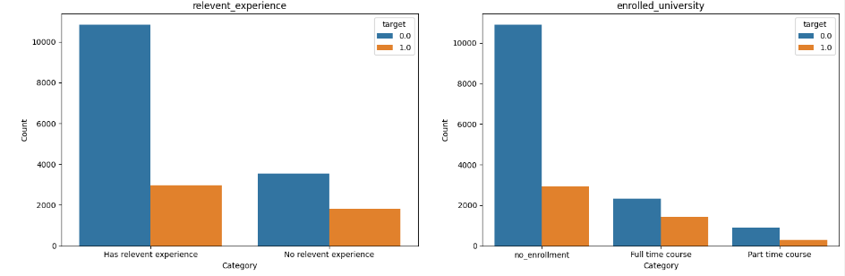

# Data Science Portfolio
#  **HR Analytic**
## Instructions for Running Python Notebooks Locally
1. Install dependencies using requirements.txt. 
2. Run notebooks as usual by using a anaconda navigator or jupyter notebook server, Vscode etc. 
3. The data used is hr-analytics.csv

### **Business Understanding**
Company R adalah Agen penempatan kerja yang menyediakan program pelatihan data science gratis ke berbagai industri company client di seluruh Indonesia. Adapun persyaratan yang diberlakukan adalah sebagai berikut :
- Terbatas untuk 100 pelamar.
- Diselenggarakan secara triwulanan (dimulai pada minggu pertama bulan Januari, April, Juli, Okt).
- Durasi pelatihan 3 bulan.  
- Agensi menawarkan kontrak penempatan kerja selama satu tahun.
- Company R mendapatkan keuntungan sebesar 0,25% dari gaji bulanan.
- Pekerjaan akan berakhir setelah periode satu tahun selesai, kecuali jika ditawarkan kontrak/perpanjangan baru.
### **`Problem`**
Bagaimana cara meningkatkan keuntungan yang diperoleh dari penempatan kerja tidak maksimal.
### **`Goals`**
Membantu Company R dalam meningkatkan keuntungan yang diperoleh dari program penempatan kerja dan memastikan biaya digunakan untuk keuntungan yang lebih besar.
### **`Objective`**
Membangun model Machine Learning yang dapat membantu mengidentifikasi apakah kandidat yang mendaftar pelatihan  sedang mencari perubahan pekerjaan atau tidak berdasarkan dari data baru yang diberikan.  
Kemampuan untuk menyaring kandidat yang mendaftar pelatihan untuk mencari perubahan pekerjaan dengan cara yang lebih tepat.  
Porsi yang lebih besar dari peserta pelatihan yang mencari perubahan pekerjaan = Lebih banyak kandidat untuk program penempatan kerja.
### **`Business Metrics`**
Revenue (pendapatan) dari program penempatan kerja.

###  **Solution Strategy**
Solusi untuk mengatasi masalah ini adalah pengembangan proyek ilmu data. Proyek ini akan memiliki model pembelajaran mesin yang dapat memprediksi apakah kandidat looking for job atau not looking for job. 
**Step 01. Data Description :** Pada bagian pertama ini data akan dikumpulkan dan dipelajari. Nilai yang hilang akan terancam di dihapus.  
**Step 02. Exploratory Data Analysis :** Proses analisis untuk memahami karakteristik data, dan hal-hal yang perlu dilakukan agar data tersebut dapat digunakan untuk proses pembelajaran model.  
**Step 03. Handling Missing Value :** Mengisi data-data yang kosong dengan nilai konstan, mean, dan modus. 
**Step 04. Handling Duplicated Data :** Melakukan pengecekan apakah terdapat data duplikat atau tidak, jika terdapat data duplikat maka dilakukan drop. 
**Step 05. Handling Invalid Values :** Melakukan pengecekan apakah ada data yang tidak lengkap atau tidak benar, jika ditemukan data invalid maka dilakukan drop. 
**Step 06. Feature Extraction :** Melakukan extrac beberapa feature dengan membuat kolom baru untuk mempermudah analisis. 
**Step 07. Feature Selection :** Melakukan seleksi feature yang akan digunakan dan drop feature yang tidak diperlukan, dalam kasus ini feature yang di drop adalah enrollee_id  
**Step 08. Handling Outliers :** Melakukan drop terhadap data outliers karena nilainya terlalu ekstrim/jauh berbeda dari data-data lain pada umumnya 
**Step 9. Feature Transformation :** Melakukan normalisasi pada data dengan skala berbeda dengan data lainnya agar menjadi data dengan skala yang sama untuk mempermudah interpretasi beberapa model ML 
**Step 10 Feature Encoding :** Merubah feature categorical menjadi feature numeric untuk mempermudah pembelajaran dengan machine learning. 
**Step 11. Handling Class Imbalance :** Melakukan handle imbalance pada data target yang terjadi sangat timpang menggunakan oversampling dan undersampling. 
**Step 12. Machine Learning Modeling :** Melatih algoritma pembelajaran mesin dan bagaimana mesin dapat memprediksi data, dalam kasus data ini menggunakan pengukuran **precision** karena tujuan yang ingin dicapai adalah untuk meningkatkan profit  
**Step 13. Hyperparameter Tuning :** Melakukan hyperparameter tuning untuk mengoptimalkan kinerja model agar memperoleh hasil yang lebih baik 
**Step 14. Feature Importance :** Menggunakan feature importance dengan melihat feature mana yang baik digunakan selanjutnya untuk dijadikan business insight dan juga sebagai tambahan eksperimen pada model (untuk mengurangi kompleksitas dan menghindari curse of dimensionality).

### **Exploratory Data Analysis**

`city_development_index`:  
**grafik 1**
- Median city_development_index berada diatas 0.9, yang artinya kebanyakan kandidat yang tidak sedang mencari perubahan pekerjaan (target 0) berasal dari kota yang memiliki nilai city_development_index yang tinggi (kot-kota maju). Sedangkan, kandidat yang sedang mencari perubahan pekerjaan (target 1) berasal dari kota dengan nilai city_development_index yang lebih rendah (median = 0.73).
- Outliers hanya terdapat pada data kandidat yang tidak sedang mencari perubahan (target 0), dimana outliers berada dibawah nilai 0.64. Artinya, meskipun banyak dari mereka yang berasal dari kota besar, terdapat beberapa kandidat dari kota kecil yang juga tidak ingin mencari perubahan pekerjaan. 

**grafik 2**
- Berbentuk Bimodal
- Lonjakan terbesar berada di sekitar nilai indeks 0.9. Ini artinya kebanyakan kandidat yang mengikuti training adalah kandidat yang berasal dari kota-kota besar.
- Namun, juga terdapat lonjakan di sekitar nilai indeks 0.62, yang menunjukkan bahwa jumlah kandidat dari kota yang tidak tergolong kota besar juga cukup banyak, walau tidak sebanyak kandidat yang berasal dari kota besar.

`training_hours`: 
**grafik 1**
- Distribusi data pada kolom `training_hours` antara kandidat yang sedang mencari perubahan pekerjaan (target 1) dan yang tidak hampir sama. Kebanyakan kandidat menyelesaikan training dalam waktu kurang lebih 50 jam.
- Pada umumnya, kandidat dapat menyelesaikan training dalam waktu 1 sampai 180 jam. Tapi ada beberapa persen orang yang tidak cukup mampu menyelesaikan training dalam jangka waktu tersebut (outlier), baik dalam kategori kandidat yang sedang mencari perubahan pekerjaan (target 1) atau yang tidak.

**grafik 2**
- Berbentuk positively skewed
- Kebanyakan kandidat dapat menyelesaikan training dalam waktu 1-180 jam.
- Tapi, terdapat data outliers, dimana data-data tersebut bernilai jauh lebih tinggi daripada data-data lainnya (dapat dilihat dari adanya pencilan pada kanan grafik).

Berdasarkan visualisasi Countplot diatas :  
1. `city`
  - Berdasarkan histogram kebanyakan kandidat berasal dari city_103 yaitu sebanyak 4355 orang.
  - Kandidat memiliki asal city yang berbeda-beda dan bervariasi sehingga kolom city memiliki keragaman cukup tinggi, baik pada kandidat yang memilih mencari perubahan pekerjaan serta pada kandidat yang tidak mencari perubahan pekerjaan.
2. `gender`
  - Kandidat yang tidak ingin mencari perubahan pekerjaan untuk jenis kelamin laki-laki memiliki proporsi yang paling tinggi diantara kandidat lainnya
  - Jumlah kandidat laki-laki yang ingin mencari perubahan pekerjaan sebanyak 3012, dengan persentase sebanyak 22.7%
  - Jumlah kandidat perempuan yang ingin mencari perubahan pekerjaan sebanyak 326, dengan persentase sebanyak 26.3%
3. `relevant_experience`  
Kandidat yang tidak ingin mencari perubahan pekerjaan dengan pengalaman yang relevan dengan Data Science memiliki proporsi lebih tinggi dibanding dengan yang ingin mencari perubahan pekerjaan, namun jika dilihat dari persentase kandidat yang ingin mencari perubahan pekerjaan, kandidat yang switch career (tidak memiliki pengalaman yg relevan dengan Data Science) memiliki persentase yang lebih tinggi daripada kandidat dengan pengalaman relevan. Berikut rinciannya : 
  - Jumlah kandidat yang ingin mencari perubahan pekerjaan dengan pengalaman yg relevan dengan Data Science adalah sebesar 2.961, dengan persentase sebanyak 21.4%
  - Jumlah kandidat yang ingin mencari perubahan pekerjaan namun tidak memiliki pengalaman yang relevan dengan Data Science (switch career) adalah sebesar 3.550, dengan persentase sebanyak 66.1%
4. `enrolled_university`  
Kandidat yang ingin mencari perubahan pekerjaan yang bukan lulusan Universitas memiliki proporsi lebih rendah dibanding dengan yang tidak, namun jika dilihat dari persentase kandidat yang ingin mencari perubahan pekerjaan, kandidat yang full time course (fokus kuliah saja) memiliki persentase yang lebih tinggi daripada kandidat lainnya (tidak kuliah, kuliah-kerja), dengan rincian sebagai berikut : 
  - Jumlah kandidat yang ingin mencari perubahan pekerjaan yang tidak berkuliah (bukan lulusan Universitas) relevan adalah sebesar 2.921, dengan persentase sebanyak 21.1%
  - Jumlah kandidat yang ingin mencari perubahan pekerjaan yang full time course (fokus kuliah saja) adalah sebesar 1.431, dengan persentase sebanyak 61.5%
5. `education_level`
  - Kandidat yang mengikuti training kebanyakan adalah para graduate.
  - Tapi, jika dilihat dari proporsinya, perbedaan unique value dalam kolom `education_level` tidak memiliki pengaruh yang signifikan. Ini dikarenakan proporsi antara kandidat yang tidak sedang mencari perubahan pekerjaan (target 0) dan yang **sedang** mencari perubahan pekerjaan (target 1) sangat mirip (target 1 memiliki proporsi sekitar 25% dari total data pada setiap unique value).
6. `major_discipline`
  - Mayoritas kandidat memiliki bidang disiplin STEM (Sains, Teknologi, Kejuruteraan, dan Matematik).
  - Mirip dengan kolom `education_level`, perbedaan unique value dalam kolom `major_discipline` tidak memiliki pengaruh yang signifikan dikarenakan proporsi antara target 0 dan target 1 yang tidak jauh berbeda (target 1 memiliki proporsi dibawah 50%).
7. `experience`
  - Mayoritas total kandidat memiliki pengalaman bekerja selama lebih dari 20 tahun diikuti oleh kandidat dengan pengalaman kerja 3-6 tahun
  - Berdasarkan histogram, kandidat yang masuk dalam kelompok dengan pengalaman kerja 1 tahun dan pengalaman kerja dibawah 1 tahun memiliki persentase lebih tinggi untuk cenderung memilih pekerjaan baru dibandingkan dengan mereka yang memilih  untuk tidak mecari perubahan pekerjaan. Sebaliknya mereka yang memiliki pengalaman kerja dengan tahun lebih tinggi cenderung memiliki persentase lebih rendah untuk mencari pekerjaan baru
8. `company_size`
  - Mayoritas total kandidat berada pada kelompok kandidat yang memiliki company_Size dengan jumlah karyawan 50-99 orang.
  - Berdasarkan histogram persentase kandidat yang mencari perubahan pekerjaan cenderung tidak memliki perbedaan yang cukup jauh antar kelompok company_size.
9. `company_type`  
Kandidat yang berasal dari Perusahaan Pvt Ltd (Private Limited Company) yang tidak ingin mencari perubahan pekerjaan memiliki proporsi lebih tinggi dibanding dengan kandidat yang ingin mencari perubahan pekerjaan, namun jika dilihat dari persentase kandidat yang ingin mencari perubahan pekerjaan, kandidat yang berasal dari jenis perusahaan ‘other’ memiliki persentase yang lebih tinggi daripada kandidat lainnya, dengan rincian sebagai berikut : 
  - Jumlah kandidat yang berasal dari Perusahaan Pvt Ltd yang ingin mencari perubahan pekerjaan adalah sebesar 1.775, dengan persentase sebanyak 22%
  - Jumlah kandidat yang berasal dari Perusahaan other yang ingin mencari perubahan pekerjaan adalah sebesar 29, dengan persentase sebanyak 24%
10. `last_new_job`  
Kandidat yang tidak ingin mencari perubahan pekerjaan dengan history pergantian pekerjaan sebelumnya sebanyak 1x memiliki proporsi lebih tinggi dibanding dengan kandidat yang ingin mencari perubahan  pekerjaan. Namun jika dilihat dari persentase kandidat yang ingin mencari perubahan pekerjaan, kandidat yang belum pernah berganti pekerjaan (first time job) memiliki persentase paling tinggi dibanding dengan yang lainnya, dengan rincian sebagai berikut :
  - Sebanyak 2125 kandidat ingin mencari perubahan pekerjaan dengan pergantian pekerjaan sebanyak 1x, memiliki persentase sebesar 26.4%
  - Sebanyak 739 kandidat ingin mencari perubahan pekerjaan yang belum pernah berganti pekerjaan, memiliki persentase sebesar 30.1%.

### **Machine Learning Modeling**
### **Scenario 1 (Baseline) -> data awal dan tidak dilakukan preprocessing**

### **Scenario 2 -> Dilakukan preprocessing dan handle class imbalance dengan oversampling**

### **Scenario 3 -> Dilakukan preprocessing dan handle class imbalance dengan undersampling**

### **Hyparameter Tuning**
#### **Random Forest**

#### Ternyata setelah dilakukan hyperparameter tuning hasilnya lebih rendah, sehingga yag diambil adalah sebelum hyperparameter tuning 

### **Feature Importance**

#### The most important features in each feature within the prediction model are :
- City development index (after normalizing the feature)
- Training Hours (after normalizing the feature)
- City
- Company Type (Other)
- Last New Job

# **Airline Customer Value Analysis Case** 

### **Instructions for Running Python Notebooks Locally**
- The data used is flight.csv

### **Business Understanding**
### **`Problem`**
Membantu maskapai penerbangan dalam memahami karakteristik customer dan mengembangkan strategi pemasaran yang tepat serta meningkatkan pendapatan.
### **`Goals`**
Mengelompokkan customer ke dalam segmen-segmen yang berbeda berdasarkan karakteristik, perilaku, dan preferensi mereka berdasarkan data yang ada, sehingga berdasarkan hasil analisa dapat ditarik kesimpulan yang dapat membantu dalam mengembangkan strategi pemesaran dan meningkatkan pendapatan.
### **`Objective`**
Membangun model machine learning yang dapat membantu maskapai penerbangan dalam memahami karakteristik customer.
### **`Business Metrics`**
- Marketing Campaign
- Revenue

###  **Solution Strategy**
Solusi untuk mengatasi masalah ini adalah pengembangan proyek ilmu data. Proyek ini akan memiliki model pembelajaran mesin yang dapat memprediksi apakah kandidat looking for job atau not looking for job. 
**Step 01. Data Description :** Pada bagian pertama ini data akan dikumpulkan dan dipelajari. Nilai yang hilang akan terancam di dihapus. 
**Step 02. Exploratory Data Analysis :** Proses analisis untuk memahami karakteristik data, dan hal-hal yang perlu dilakukan agar data tersebut dapat digunakan untuk proses pembelajaran model. 
**Step 03. Handling Missing Value :** Mengisi data-data yang kosong dengan nilai konstan, mean, dan modus. 
**Step 04. Handling Duplicated Data :** Melakukan pengecekan apakah terdapat data duplikat atau tidak, jika terdapat data duplikat maka dilakukan drop. 
**Step 05. Handling Invalid Values :** Melakukan pengecekan apakah ada data yang tidak lengkap atau tidak benar, jika ditemukan data invalid maka dilakukan drop. 
**Step 06. Feature Extraction** 
**Step 07. Feature Selection :** Melakukan seleksi feature yang akan digunakan dan drop feature yang tidak diperlukan, dalam kasus ini feature yang digunakan ada 5 yaitu  
1. **GENDER** : Jenis Kelamin  
2. **FLIGHT_COUNT** : Jumlah Penerbangan  
3. **BP_SUM** : Rencana Perjalanan  
4. **SUM_YR_1** : Total Pendapatan  
5. **Avg_Discount** : Rata_rata Diskon yang didapatkan customer.  

**Step 08. Handling Outliers :** Melakukan drop terhadap data outliers karena nilainya terlalu ekstrim/jauh berbeda dari data-data lain pada umumnya 
**Step 9. Feature Transformation :** Melakukan standarisasi karena tanpa standarisasi model machine learning clustering tidak bisa dilakukan 
**Step 10. Elbow Method :** Dilakukan untuk menetukan jumlah cluster terbaik yang dapat digunakan untuk menghasilkan hasil cluster yang terbaik dan dapat memaksimalkan kualitas hasil cluster  
**Step 11. Clustering K-Means :** Melakukan pengelompokan data dengan K-Means clustering untuk melihat persebaran datanya.   
**Step 12. Interpretasi Statistic :** Melihat hasil cluster dengan persebaran nilai statistics.

### **Elbow Method**
.PNG)

### **Clustering K-Means**
.PNG)

### **Interpretasi Statistic**

**Deskripsi Customer**  
Berdasarkan persebaran statistik untuk masing-masing cluster dapat disimpulkan sebagai berikut :
- **FLIGHT_COUNT (Jumlah Penerbangan Customer)** terbanyak terdapat pada cluster 0 sebesar 20574, akan tetapi rata-rata dan jumlah penerbangan tertingginya terdapat pada cluster 2 sebesar 1.85 dan 16467.
- **BP_SUM (Rencana Perjalanan Customer)** kesuatu tempat yang sama terdapat pada cluster 0 sebesar 20574, akan tetapi rata-rata dan jumlah rencana perjalanan tertingginya terdapat pada cluster 2 sebesar 1.86 dan 16566.
- **SUM_YR_1 (Total Pendapatan)** terbanyak selama pemesanan tiket oleh customer terdapat pada cluster 0 sebesar 20574, akan tetapi rata-rata dan jumlah pendapatan tertingginya terdapat pada cluster 2 sebesar 1.76 dan	15726.
- **avg_discount (Rata-rata Diskon)** terbanyak terdapat pada cluster 0 sebesar 20574, akan tetapi rata-rata dan jumlah diskon yang diberikan tertingginya terdapat pada cluster 2 sebesar 0.32 dan	2899.
- **GENDER (Jenis Kelamin)**, berdasarkan pengelompokan berdasarkan masing-masing gender terbanyak terdapat pada cluster 0 sebesar 20574, akan tetapi rata-rata dan jumlah gender tertinggi berdasarkan masing-masing pengelompokan gender terdapat pada cluster 1 sebesar 1.7 dan 23121.
- Sehingga dapat disimpulkan, berdasarkan data pemesanan tiket customer yang lebih dominan memesan tiket terbanyak pada cluster 0, sedangkan berdasarkan rata-rata dan jumlah pemesanan tiket yang lebih dominan terdapat pada cluster 2.  

**Business Recommendations**
- Lebih memperhatikan cluster 3, karena berdasarkan persebaran statistiknya cluster 3 memiliki nilai lebih rendah daripada cluster lainnya untuk setiap data pengelompokan, meskipun secara banyaknya pemesanan tiket tidak terlalu rendah.
- Rekomendasinya mungkin bisa lebih memberikan penawaran yang lebih kepada cluster 3 seperti penawaran promo jika customer bersedia membeli tiket dengan tujuan perjalanan yang lebih jauh, sehingga dapat meningkatkan revenue bagi company.

# **Sentiment Analysis**
### **Instructions for Running Python Notebooks Locally**
- The data used is sentiment-analysis.xlsx

### **Business Understanding**
**Topik :** Analisis Sentimen Masyarakat Terhadap Peperangan Rusia dan Ukraina.
### **`Problem`**
Teks yang akan dianalisis tidak memiliki konteks yang jelas, sulit untuk menentukan sentimen yang tepat. 
### **`Goals`**
Mengetahui opini dan sentimen dari masyarakat melalui teks yang akan dianalisa.
### **`Objective`**
Membangun model Machine Learning yang dapat membantu mengidentifikasi opini dan sentimen masyarakat terhadap peperangan Rusia dan Ukraina.
### **`Business Metrics`**
- Public Opinion (mengetahui apakah masyarakat mendukung atau menentang salah satu pihak yang terlibat dalam konflik, sehingga dapat membantu pemerintah atau organisasi terkait dalam memahami tingkat dukungan masyarakat terhadap kebijakan atau tindakan yang diambil)
- Reputasi Internasional (bagaimana reputasi Rusia dan Ukraina dipandang oleh masyarakat internasional dan media, sehingga dapat membantu pemerintah atau organisasi terkait untuk mengambil tindakan yang tepat dalam membangun citra yang lebih baik).

### **Solution Strategy**
Solusi untuk mengatasi masalah ini adalah pengembangan proyek ilmu data. Proyek ini akan memiliki model pembelajaran mesin yang dapat memprediksi apakah kandidat looking for job atau not looking for job. 
**Step 01. Data Description :** Pada bagian pertama ini data akan dikumpulkan dan dipelajari. Nilai yang hilang akan terancam di dihapus. 
**Step 02. Data Cleaning :** Melakukan pembersihan data teks dengan menghapus URL, username, pic twitter, hastag, angka, tanda baca, dan emoticon 
**Step 03. Case Folding :** Merubah data teks menjadi huruh kecil semua  
**Step 04. Data Normalization :** Merubah kata-kata yang kurang relavan menjadi relavan, dan merubah kata singkatan kebentuk dasarnya 
**Step 05. Stopword Removal :** Menghapus kata penghubung, kata depan, kata ganti seperti **dan**, **atau**, **ke**, **dari**, dan lain-lain karena dianggap tidak memiliki arti dalam proses klasifikasi 
**Step 06. Tokenizing :** Memecah setiap kalimat menjadi sebuah token dan merubahnya kedalam bentuk kata dasar 
**Step 07. Stemming :** Merubah setiap kata yang ber-imbuhan menjadi kata dasar 
**Step 07. TF-IDF :** Melakukan pembobotan menggunkaan TF-IDF untuk menghitung banyaknya kata yang muncul dalam suatu dokumen 
**Step 08. Klasifikasi Support Vector Machine :** Melakukan pembelajaran dengan model machine learning dengan **Support Vector Machine** untuk melihat hasil klasifikasi dari teks 
**Step 09. Evaluasi Model :** Melakukan evaluasi model untuk melihat hasil prediksi yang telah dilakukan, adapun pengukuran yang digunakan adalah **Accuracy**.

### Evaluasi Model

